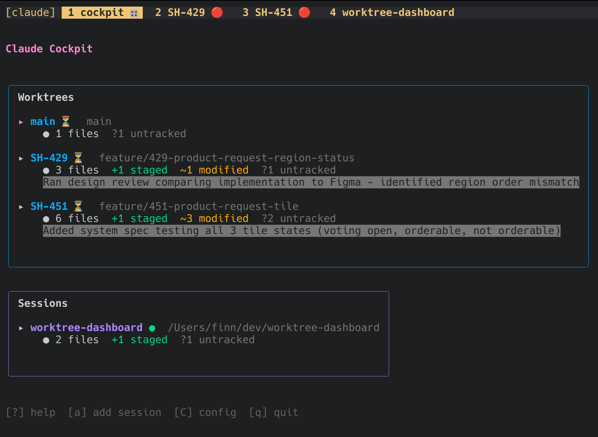

# claude-cockpit

Your command center for wrangling multiple Claude Code sessions. Because one Claude is never enough. 🛫




## What's this?

A TUI dashboard for managing parallel Claude Code sessions across git worktrees and other projects. Think of it as air traffic control for your AI pair programming adventures.

**Opinionated by design.** This tool assumes you're:
- Using git worktrees (if you're not, you should be)
- Running everything in tmux (because tabs are for browsers)
- Working with Claude Code as your daily driver
- Possibly juggling multiple features/bugs at once without losing your mind

## Features

- 📂 **Worktree overview** - All your worktrees at a glance with git status
- 🔄 **Session management** - Add any directory as an additional session
- 🟢🔴 **Claude status** - Green when Claude is working, red when waiting for input
- 🚀 **One-key tmux integration** - Jump into any session instantly
- 📝 **Context restoration** - Pick up exactly where you left off
- 🖥️ **Server window** - Run your dev server in a dedicated tmux window
- 🔌 **Server indicator** - See which worktree has a server running right in the tmux status bar
- 📊 **Diff view** - Open git diff in a split with one key

## Installation

```bash
go install github.com/tonekk/claude-cockpit/cmd/claude-cockpit@latest
```

Or the old-fashioned way:

```bash
git clone git@github.com:tonekk/claude-cockpit.git
cd claude-cockpit
go build -o claude-cockpit ./cmd/claude-cockpit
```

## Usage

```bash
# Fire it up (run from the root of any git repo)
claude-cockpit
```

### Parameters

| Flag | What for |
|------|----------|
| `-s`, `--server-command <cmd>` | Command to run when you press `s` (e.g. `bin/rails server`) |
| `-e`, `--env KEY=VALUE` | Env var for the server command. Repeatable |
| `-E`, `--editor <cmd>` | Editor opened with `e` (default: `code`) |
| `--list` | Print worktrees and exit, no TUI |
| `-h`, `--help` | Show help |

```bash
claude-cockpit -s "npm run dev" -e PORT=3000 -e NODE_ENV=development -E cursor
```

### cockpit.yml

Put a `cockpit.yml` in your repo root so you don't have to repeat flags:

```yaml
# Command to run when you press 's'
server: bin/rails server

# Env vars for the server command
env:
  PORT: 3000
  RAILS_ENV: development

# Commands run in every new worktree before Claude starts.
# Stops and shows an error if any of them fails.
setup:
  - bundle install
  - bin/rails db:setup
```

Flags win over `cockpit.yml`. `env` entries are merged, a `-e` flag overrides a key of the same name.

`claude-cockpit run-setup` runs the `setup` commands in the current directory by hand.

### Keybindings

| Key | What it does |
|-----|--------------|
| `Enter` | Open in tmux with Claude |
| `o` | Open in tmux (no Claude) |
| `e` | Open in your editor |
| `s` | Toggle server |
| `D` | Open git diff in split |
| `a` | Add session |
| `w` | Add worktree |
| `d` | Delete worktree/session |
| `c` | Config |
| `l` / `→` | Expand |
| `h` / `←` | Collapse |
| `j/k` | Navigate |
| `?` | Help |
| `q` | Quit |

## Sessions

Not everything is a worktree. Sometimes you're working on a completely different project. That's what sessions are for.

Press `a`, enter a path, and boom - it's in your cockpit, ready to launch. The tmux window opens immediately with Claude waiting for your command.

## Waiting Indicator Setup

Want to know when Claude is waiting for you across all your sessions? Add these hooks to `~/.claude/settings.json`:

```json
{
  "hooks": {
    "Stop": [
      {
        "matcher": "",
        "hooks": [
          {
            "type": "command",
            "command": "claude-cockpit notify-waiting"
          }
        ]
      }
    ],
    "PreToolUse": [
      {
        "matcher": "",
        "hooks": [
          {
            "type": "command",
            "command": "claude-cockpit clear-waiting"
          }
        ]
      }
    ]
  }
}
```

Now your tmux window names show Claude's status: 🟢 when actively working, 🔴 when waiting for your input. No more wondering "wait, did Claude finish?"

## Requirements

- Go 1.21+
- tmux (non-negotiable)
- Claude Code
- A love for terminal UIs

## License

MIT - do whatever you want with it.

---

*Built for developers who think "I'll just check on that other branch real quick" and end up with 12 Claude sessions.*
